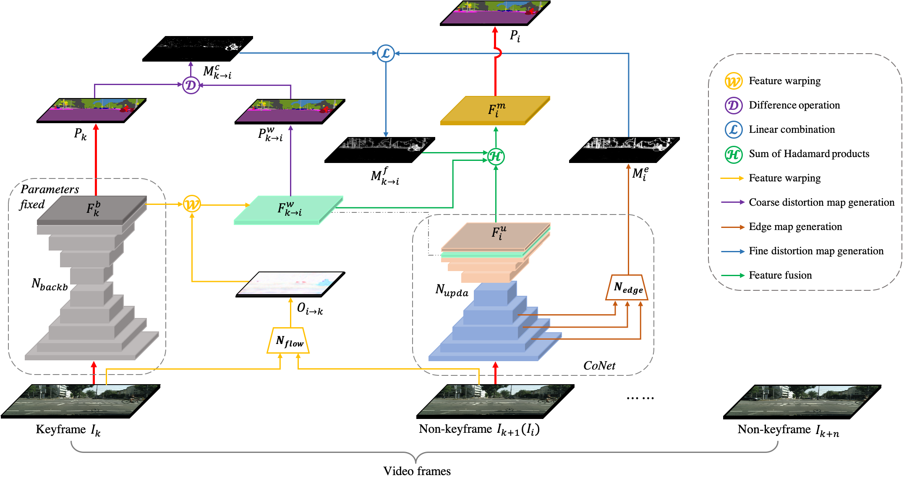
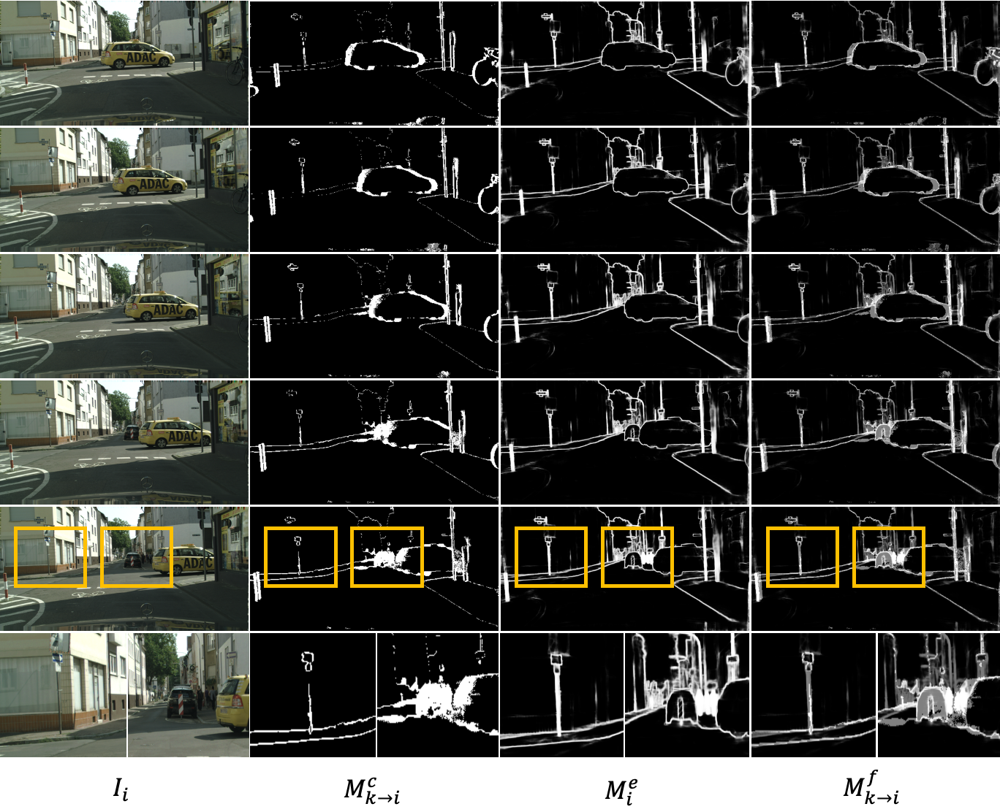

# EVSS
Distortion Map-Guided Feature Rectification for Efficient Video Semantic Segmentation

We present an efficient distortion map-guided feature rectification method for video semantic segmentation, specifically targeting the feature updating and correction on the distorted regions with unreliable optical flow. The updated features for the distorted regions are extracted from a light correction network (CoNet). A distortion map serves as the weighted attention to guide the feature rectification by aggregating the warped features and the updated features. The generation of the distortion map is simple yet effective in predicting the distorted areas in the warped features, i.e., moving boundaries, thin objects, and occlusions. 

- Model architecture. Given a video, the video frames are divided into keyframes and non-keyframes. The segmentation prediction of the keyframe is achieved by the backbone network. The segmentation prediction of the non-keyframe is achieved by the proposed distortion map-guided feature rectification method.

<p align="center"></p>

- Coarse-to-fine distortion map. An example to show different types of maps over time: coarse distortion map, edge map and fine distortion map. 
<p align="center"></p>


## Dependencies

- Python 3.5
- PyTorch 1.5.0
- CUDA 10.2 
- cuDNN 7.6.5

The experiments are conducted on a Ubuntu 18.04 LTS PC with two NVIDIA GeForce GTX 1080 Ti. Driver version is 460.91.03. GCC version is 7.5.0. Please refer to [`requirements.txt`](requirements.txt) for more details about the packages used.

## Dataset setup

Please download the [Cityscapes](https://www.cityscapes-dataset.com/downloads/) and [CamVid](http://mi.eng.cam.ac.uk/research/projects/VideoRec/CamVid/) **video sequences** dataset. For Cityscapes dataset, you need to send an email to Cityscapes requesting permission for the video dataset.

Your directory tree should be look like this:
````bash
$EVSS_root/dataset
├── camvid
│   ├── 11labels
│   │   ├── segmentation annotations
│   └── video_image
│       ├── 0001TP
│           ├── decoded images from video clips
│       ├── 0006R0
│       └── 0016E5
│       └── Seq05VD
├── cityscapes
│   ├── gtFine
│   │   ├── train
│   │   └── val
│   └── leftImg8bit_sequence
│       ├── train
│       └── val

````

## Training
- Create a virtual environment and install the required python packages.
- Install resampled 2d modules for the feature warping process.
```
cd $EVSS_ROOT/model/resample2d_package
python setup.py build
cd $EVSS_ROOT
```
- Download the pretrained CSRNet and FlowNet models. 

   Put the pretrained models [CSRNet_Cityscapes](https://drive.google.com/file/d/1onVZChvwK25OUW4Now6vgGXSzlnhmK2q/view?usp=sharing), [CSRNet_CamVid](https://drive.google.com/file/d/16e7T4fMarJKIzn5_-e27UhRPmaZgdvzN/view?usp=sharing) and [FlowNet](https://drive.google.com/file/d/1xJjhkjVGjKJyPVBfhlELl1Gzse4RFm-_/view?usp=sharing) under $EVSS_ROOT/saved_model/pretrained.


- Run bash file to strat training.
````bash
# training on Cityscapes
bash run/train_citys.sh
# training on CamVid
bash run/train_camvid.sh
````

## Testing
- Run bash file to strat testing.
````bash
# testing on Cityscapes
bash run/val_citys.sh
# testing on CamVid
bash run/val_camvid.sh
````


